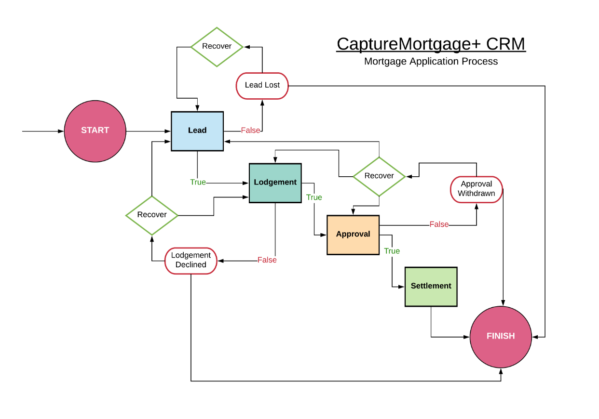

# Capture Mortgage+ - CRM System

**Github:** https://github.com/dlim28/CaptureMortgage

**Deployment:** *A link (URL) to your published App*

    Our Project is a CRM (Customer Relationship Management) system for *Capture Mortgage+, CM+ is a mortgage business. The company provides a service to its customers by approving them for mortgages. Before we were asked to take on this project CM+ was keeping track of all of their clients with pen and paper. This system was inefficient for a company with so many clients that needed to be organized and that are constantly moved between different status's.  

CM+ is a mortgage business. The company provides a service to its customers by approving them for mortgages. The process workflow for the mortgage application process is as per below: 

customers can easily be moved around from status to status until they are either Declined, Approved, or Lost. This application makes it easy to move those customers around and keep track of where an individual is in their mortgage process.

# Application 

**Application Goals:**

1. Simple user-friendly CRM
2. Store all customers and the track the status of their mortgage application process
3. Visually appealing dashboard with graphs

___

The application features 7 different tables with a dashboard as the homepage displaying the 4 main tables.

The tables are broken up into:

**Leads:**
The Leader Board tabulates all customers in database with the status LEAD and groups the data by months
and referrer.

**Approvals:** 
The Approvals Board tabulates all the customers in database with the status APPROVAL.

**Lodgements:**
The Lodgements Board tabulates all the customers in database with the status LODGEMENT.

**Settlements:**
The Settlements Board tabulates all the customers in database with the status SETTLEMENT.

**Employee Leaderboard:**

**Referrer Leaderboard:**

**CRM:**
The CRM is the centralized database that stores all the customers in the database.

There is a **navbar** that is always present at the top of each page on the application. It keeps track of of how many **leads**, **lodgements**,  **approvals**,  and **settlements** are currently entered into the database. The **navbar** provides quick links to all of the different pages within the app.

**Navigational Menu Tabs**
- DASHBOARD 
- LEADS

(dropdown)

*NewLead* // *Overview* // *LeaderBoard* 
- LODGEMENTS
- APPROVALS
- SETTLEMENTS 
- CRM
- LOGOUT

*current month*
-   QTY of all customers that have the status
(LEAD, LODGEMENTS, APPROVALS, or SETTLEMENTS) for the current month

*current month $*
- Sum amount $ for all the customers that have the status (LEAD, LODGEMENTS, APPROVALS, or SETTLEMENTS) for the current month

*total*
- Total QTY of all customers that have the status (LEAD, LODGEMENTS, APPROVALS, or SETTLEMENTS) ytd. 

*total $*
- Total amount $ of all customers that have the status (LEAD, LODGEMENTS, APPROVALS, or SETTLEMENTS) ytd. 

___

On the dropdown menu under leads in the navbard, there is a 'New Client' link that enables to user to add in new clients.

When a new client is entered the the status is set to Lead by default and the time/date of the lodgement is recorded.

Referrer

Source

Category

Lender

There are 2 different status a customer can be in:

**In-Active Customers** are a customer that has the status:
- Lead Lost
- Lodgement Declined
- Approval Withdrawn

**Active Customers** are a customer that has the status:
- Lead
- Lodgement
- Approval
- Settlement
___

## Tech stack:
- html
- MERN Stack (Mongo, Express, React, Node)
- css
- Mongodb

*package.json -frontend*

*package.json -backend*

# Using the CM+ CRM System

# Designs and Planning

**figma:**
https://www.figma.com/file/L5XYRNo6UUDVmq3A7JyASe7s/CRM-System-Wireframes?node-id=0%3A1

**ERD:**

**Phase 1 and 2 / timeline**

**Trello Boards**

**OO design documentation**

react => 

# Client Communications:

Our initial meeting with the client to discuss the project

# Short Answer questions

## a. What are the most important aspects of quality software?

There are 2 main features that a good software must have. It needs to do it's just correctly and solve the problem that it was developed to do. If you're problem is x, than the software must be able to solve x or at the very minimum make x more manageable. 

The second aspect is that it needs to be user friendly. A lot of the population don't know the ins and outs of software, so the app needs to be able to be used and enjoyed by everyone. Straight to the point and sleek.

## b. What libraries are being used in the app and why?

- react
- axios
- react-dom
- react-js-pagination
- react-router-dom
- react-scripts
- react-table
- nodemon
- express
- mongoose
- jest
- dotenv
- cors

## c. A team is about to engage in a project, developing a website for a small business. What knowledge and skills would they need in order to develop the project?

## d. Within your own project what knowledge or skills were required to complete your project, and overcome challenges?

## e. Evaluate how effective your knowledge and skills were this project, using examples, and suggest changes or improvements for future projects of a similar nature?