# Capture Mortgage+ CRM System

**Github:** https://github.com/dlim28/CaptureMortgage

**Deployment:** http://cmpfrontend-env.mpxq6chsga.us-east-2.elasticbeanstalk.com/

## Project Description
> The project is to build a functional Customer Relationship Management(CRM) to assist the mortgage division of CMP (Capture Mortgage Plus)
### Purpose
```
The purpose of the application is to assist the employees of Capture Mortgage Plus to track the application of a mortgage from their many customers.

It will be an end to end tracking system that will allow the employees to see the status and history of the progress of a mortgage application
```
### Functionality
**Application Goals:**

1. Simple user-friendly CRM
2. Store all customers and the track the status of their mortgage application process
3. Visually appealing dashboard with graphs

___

The application features 7 different tables with a dashboard as the homepage displaying the 4 main tables.

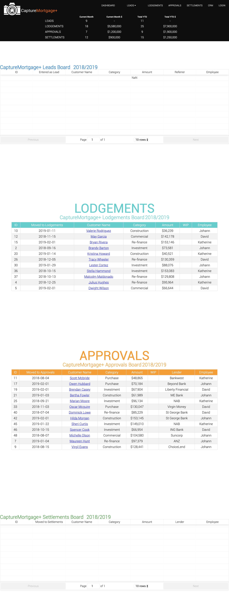

The tables are broken up into:

**Leads:**
The Leader Board tabulates all customers in database with the status LEAD and groups the data by months
and referrer.

**Approvals:** 
The Approvals Board tabulates all the customers in database with the status APPROVAL.

**Lodgements:**
The Lodgements Board tabulates all the customers in database with the status LODGEMENT.

**Settlements:**
The Settlements Board tabulates all the customers in database with the status SETTLEMENT.

**Employee Leaderboard:**
This board sorts all the mortgages that have a status of LEAD and are then sorted by the date of lead as well as the employee by alphabetical order 

**Referrer Leaderboard:**
The referrer leaderboard shows a table that calulates what kind of referrers have been set on a mortgage that has the LEAD status. This is then broken up per month and tallied. It also has a total leads to leads lost percentage for the month

**CRM:**
The CRM is the centralized database that stores all the customers in the database.

There is a **navbar** that is always present at the top of each page on the application. It keeps track of of how many **leads**, **lodgements**,  **approvals**,  and **settlements** are currently entered into the database. The **navbar** provides quick links to all of the different pages within the app.

**Navigational Menu Tabs**
- DASHBOARD 
- LEADS

(dropdown)

*NewLead* // *Overview* // *LeaderBoard* 
- LODGEMENTS
- APPROVALS
- SETTLEMENTS 
- CRM
- LOGOUT


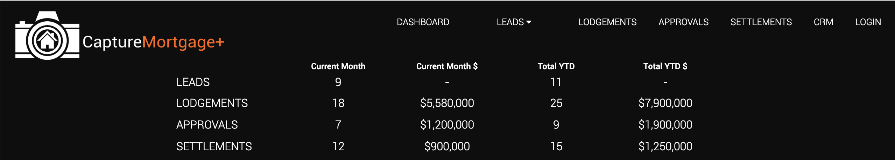


*current month*
-   QTY of all customers that have the status
(LEAD, LODGEMENTS, APPROVALS, or SETTLEMENTS) for the current month

*current month $*
- Sum amount $ for all the customers that have the status (LEAD, LODGEMENTS, APPROVALS, or SETTLEMENTS) for the current month

*total*
- Total QTY of all customers that have the status (LEAD, LODGEMENTS, APPROVALS, or SETTLEMENTS) ytd. 

*total $*
- Total amount $ of all customers that have the status (LEAD, LODGEMENTS, APPROVALS, or SETTLEMENTS) ytd. 

___


On the dropdown menu under leads in the navbard, there is a 'New Client' link that enables to user to add in new clients.

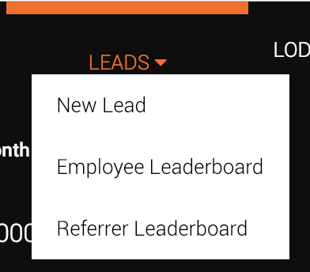

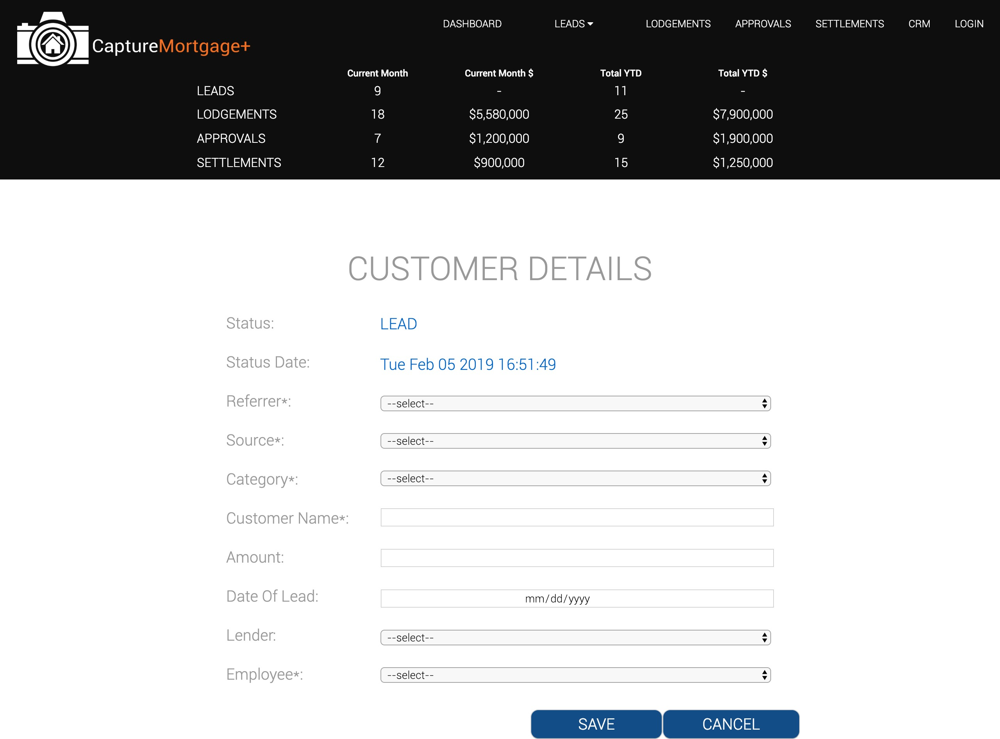

When a new client is entered the the status is set to Lead by default and the time/date of the lodgement is recorded.

Referrer
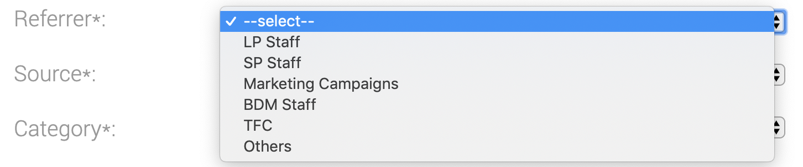
Source
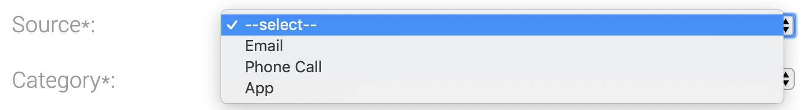
Category
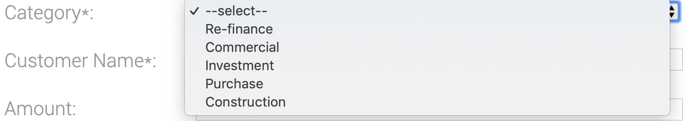
Lender
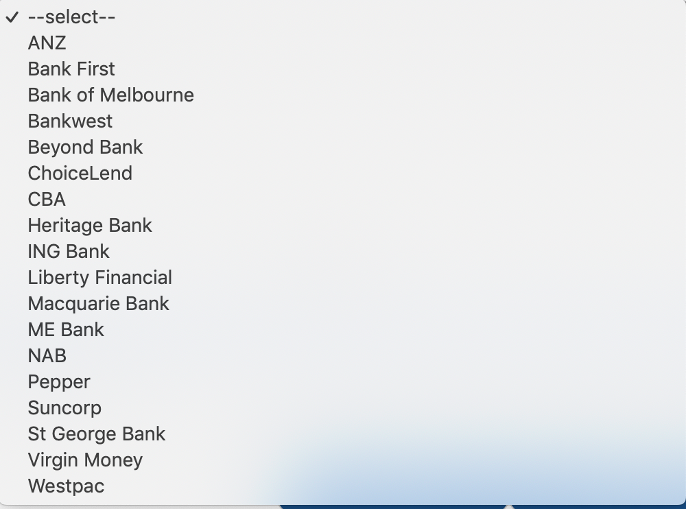

There are 2 different status a customer can be in:

**In-Active Customers** are a customer that has the status:
- Lead Lost
- Lodgement Declined
- Approval Withdrawn

**Active Customers** are a customer that has the status:
- Lead
- Lodgement
- Approval
- Settlement
___
## Tech stack:
- HTML
- MERN Stack (Mongo, Express, React, Node)
- CSS
- MongoDB

*package.json -frontend*
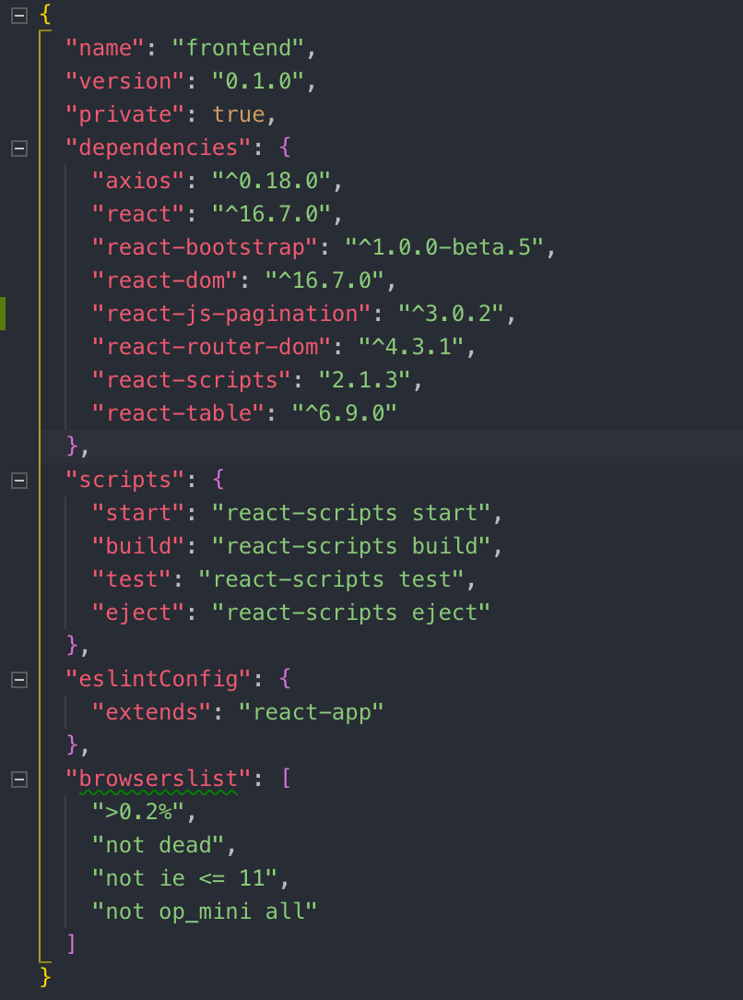
*package.json -backend*
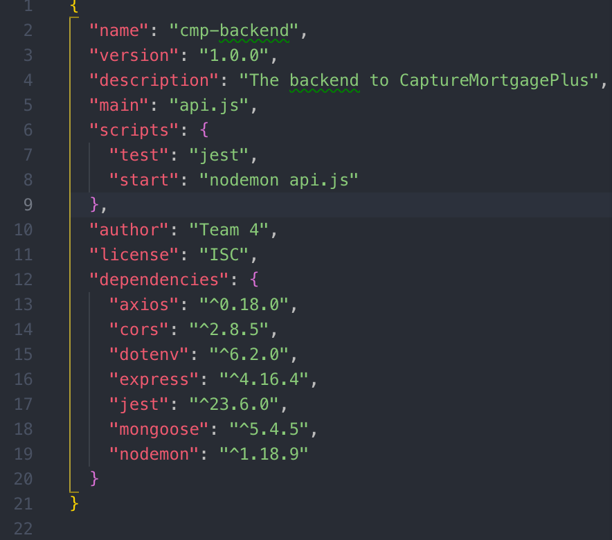
# Using the CM+ CRM System

## Setup
In order to setup the environment appropriately, the recommendation is to use homebrew to install some prequisite packages

>$curl-fsSLhttps://raw.githubusercontent.com/Homebrew/install/master/install

React:
>$npm install -g create-react-app

Node:
>$brew install node

Mongo:
>$brew install mongodb

In order to setup the application you will need to pull the repo from github.
___
## Configure
For local development, you will need to install npm on a unix type machine. Using the CLI navigate to the each of the folders and then run 

> npm i

This command will install all missing packages for your environment.

You will also need to have mongoDB installed as it uses mongoDB to create and store the database
___
## Deployment
In order to deploy this in a production service, you will need to put the environment variables in the production services ENV files. You will also need 2 different services, one for the front end and one for the back end.

Ideally you should deploy the backend and database first in order to obtain the routes necessary for the frontend to connect.

Once the routes are confirmed make the necessary changes to the frontend by using the appropriate URL's for the GET, PATCH and POST requests
___
## Usage
The crm system is very easy to use. Once the user has logged in they can click on the 'New Lead' tab under the 'LEADS' board. 

Enter your new lead and the leads table will be populated with it as well as the dashboard. The new client can be moved inbetween different statuses withing the mortgage process by clicking on the name of the client and pressing update status on the bottom of the form.

The system is designed to be easy and straight to the point. 

# Designs and Planning

> Our client had a very clear vision on how the UI should look. Due to the strong vision of the clients application, we have decided to adapt to their UI standards

**Figma:**
https://www.figma.com/file/L5XYRNo6UUDVmq3A7JyASe7s/CRM-System-Wireframes?node-id=0%3A1

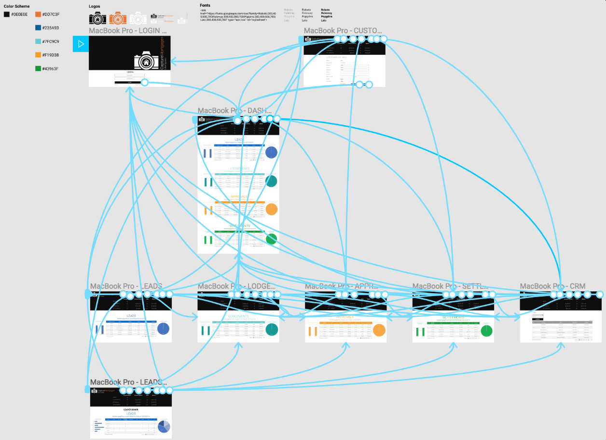

**ERD:**

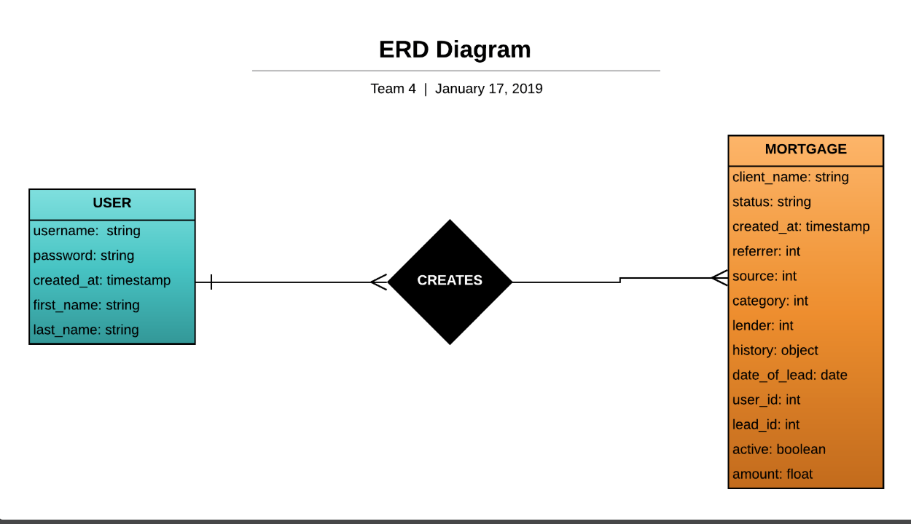

**Dataflow Diagram**

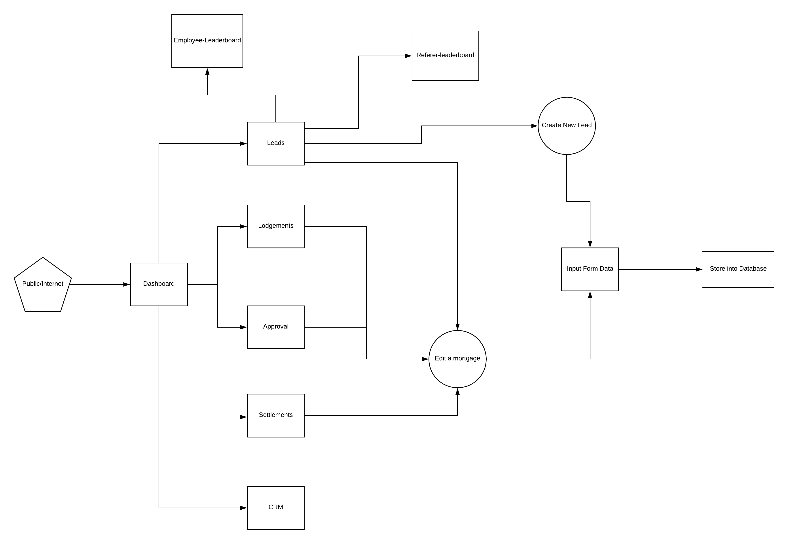

**OO design documentation**

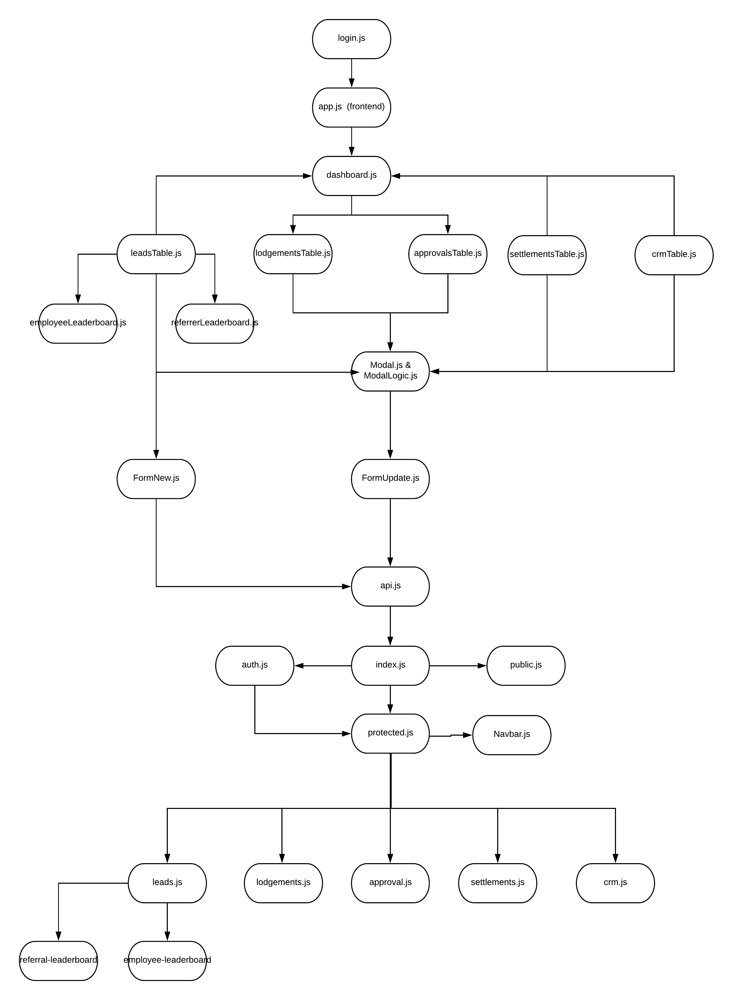

# Project Management
```
The project was to be completed within 3 weeks

The following deadlines were set in order to deliver a product

- Friday 18th Jan: Project idea signed off.
- Wed 23rd Jan: Wireframes, database structure, and user stories, and ready to start code, or Friday 25th at the latest.
- Friday 25th Jan: First deploy, (or Wed 30th at the latest).
- Friday 1st Feb: MVP achieved.
- Thursday 7th, Feb: Final deadline, 10pm.

```

**Phase 1 and 2 / timeline**


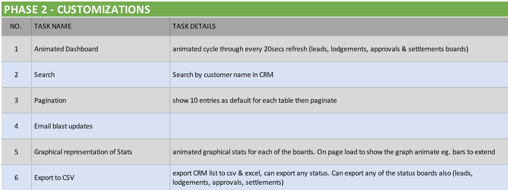

**Trello Boards**

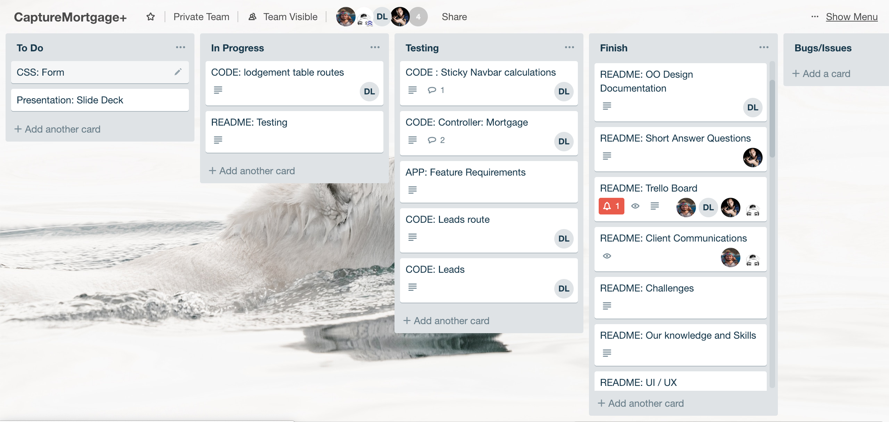
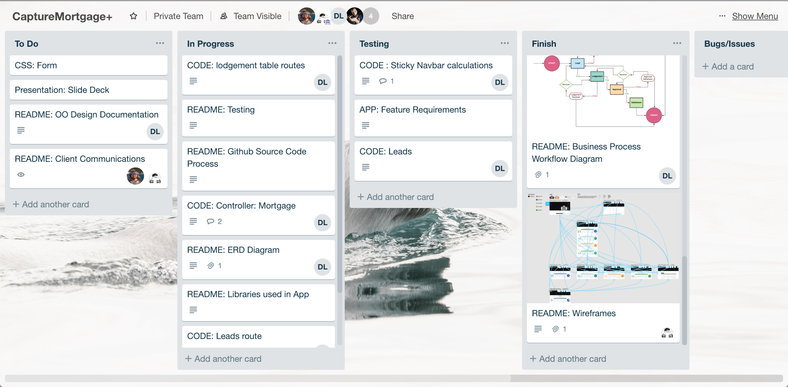

# Client Communications:
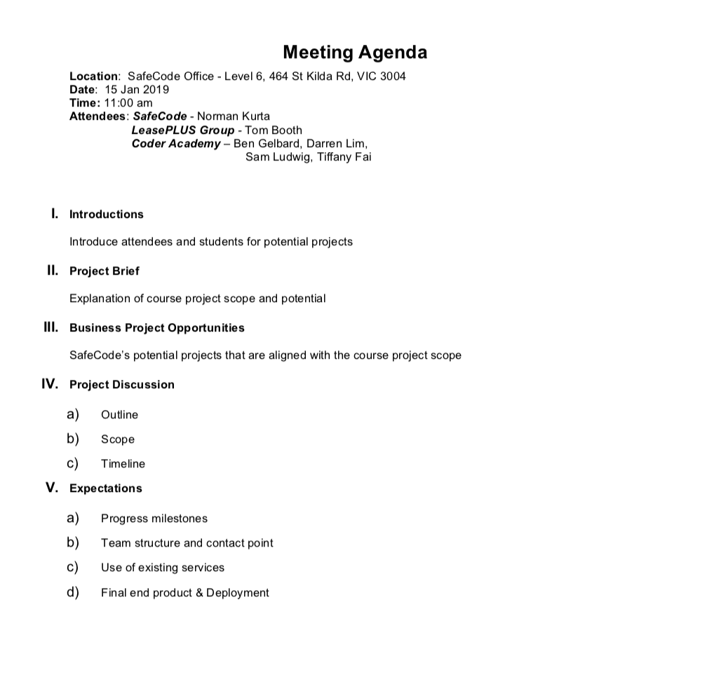

Our initial meeting with the client to discuss the project

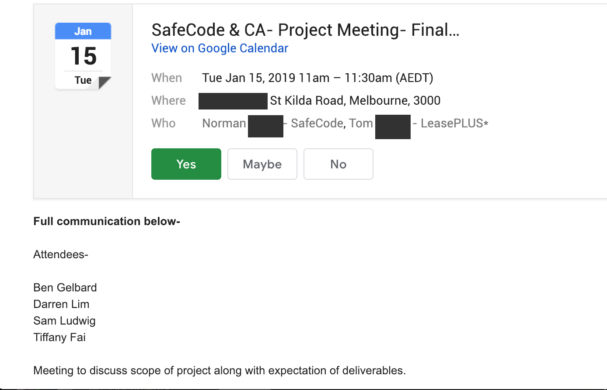

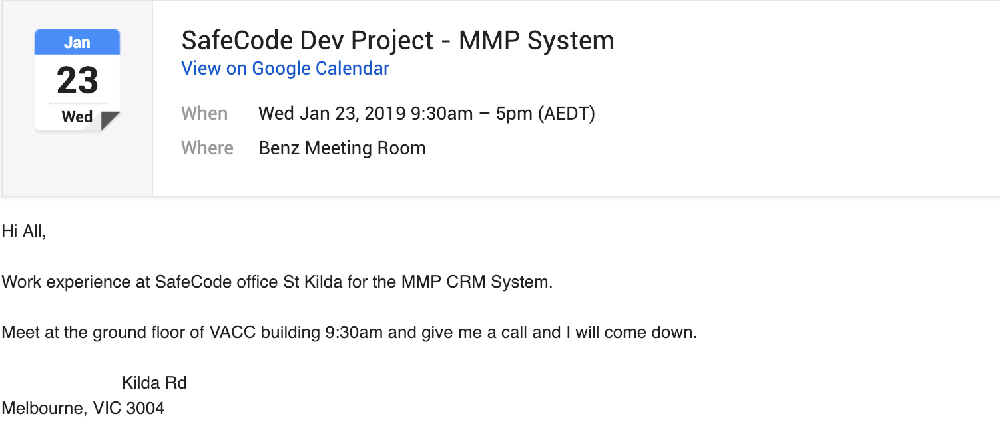

# Tools and Methodologies

## Agile development methodologies
```
Morning stand-ups
Customer Collaboration
Iterative Development
User Stories
SCRUM Meetings
Pair programming
Regular Client Meetings
```

## Testing
```
We have used postman to test our routes on both deployment and development
```
>Postman [Link](https://documenter.getpostman.com/view/6599539/RztpoSGA)

## Code review

```
Code is reviewed when members of the team are pushing git branches to the main repository
All branches are checked with a partner to ensure that merging to the master is done seamlessly and conflicts resolved with as little issues as possible
```

# Short Answer questions
## a. What are the most important aspects of quality software?

There are 2 main features that a good software must have. It needs to do it's just correctly and solve the problem that it was developed to do. If you're problem is (x), than the software must be able to solve (x) or at the very minimum make (x) more manageable.

The second aspect is that it needs to be user friendly. A lot of the population don't know the ins and outs of software, so the app needs to be able to be used and enjoyed by everyone. Straight to the point and sleek.

As an added bonus the code should be dry and easy to read for any developers that want to inspect the inner workings of the software.

## b. What libraries are being used in the app and why?

- react
- axios
- react-dom
- react-js-pagination - for pagination
- react-router-dom
- react-scripts
- react-table - for react tables
- nodemon: to auto run and reset the server
- express
- mongoose
- jest
- dotenv
- cors

## c. A team is about to engage in a project, developing a website for a small business. What knowledge and skills would they need in order to develop the project?

It all depends on what the website needs. Every business requires different features and data on their website. An, effective back and forth with the client to know exactly what they want and expect will save a lot of headache in the future. Sitting down with them and brainstorming what both parties could do for each other.

Good communication within the group is also key, a team should be able to know everyone's strong points and weak points. Then tasks can be divided up from there. 

## d. Within your own project what knowledge or skills were required to complete your project, and overcome challenges?

We needed to know how to use react and many of it's components, as well as pulling data from JSON objects to get them to display. A general knowledge of which npm's to use to overcome some hurdles was also very useful for this project.  

## e. Evaluate how effective your knowledge and skills were this project, using examples, and suggest changes or improvements for future projects of a similar nature?

For the backend there were many issues and design considerations that needed to be done as we developed the service.
One of the major decisions that was changed often was the inclusion of date objects or strings for the mongoose schema. As we were inexperienced with the complexities of mongoose and mongoDB objects we had changed the schema a few times in order to compensate for sorting and querying using the mongoDB commands.
We had to learn through trial and research, that the mongoDB commands only do the appropriate search based on proper objects. In our case when we had to query dates, the mongoose schema originally had dates as strings in order to display it easily on the frontend. However in order for the query to be effective, we then had to change it back to date objects in order to use the date queries provided by mongoDB.
